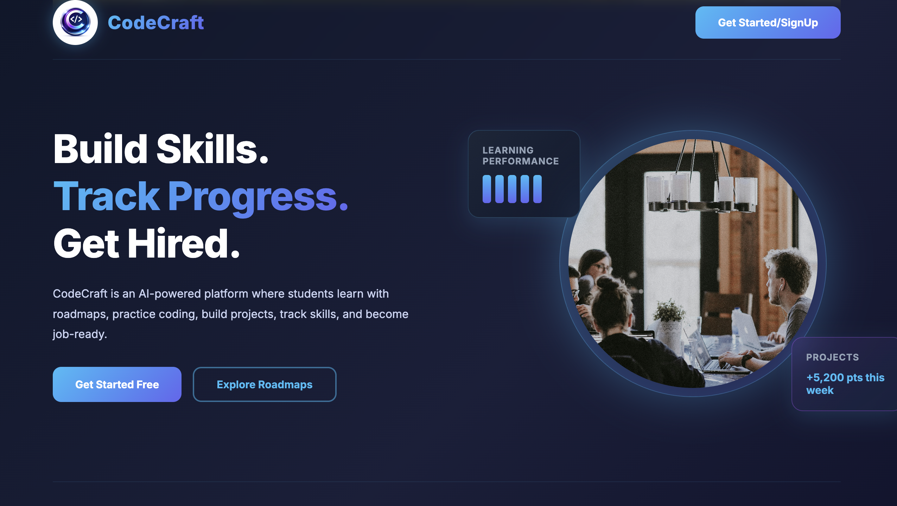
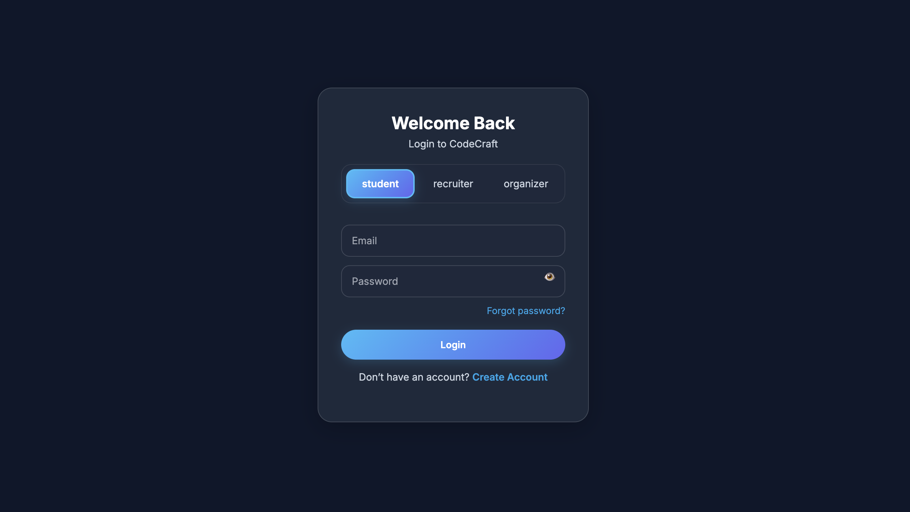
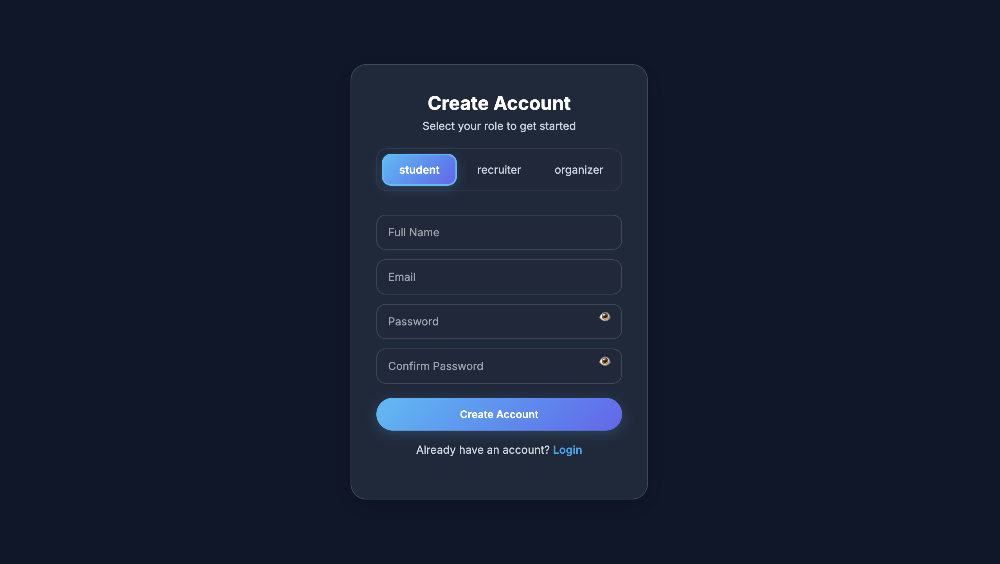
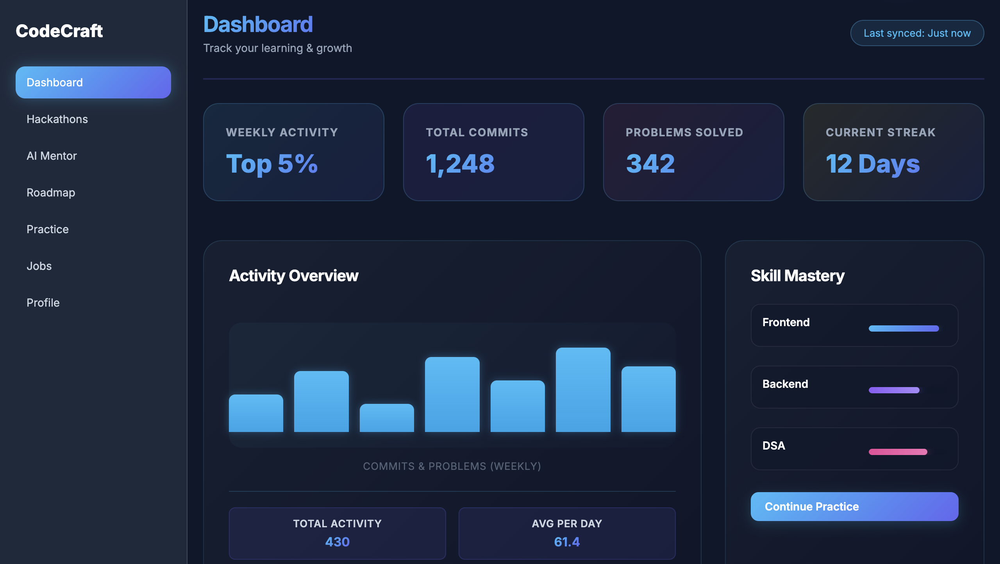
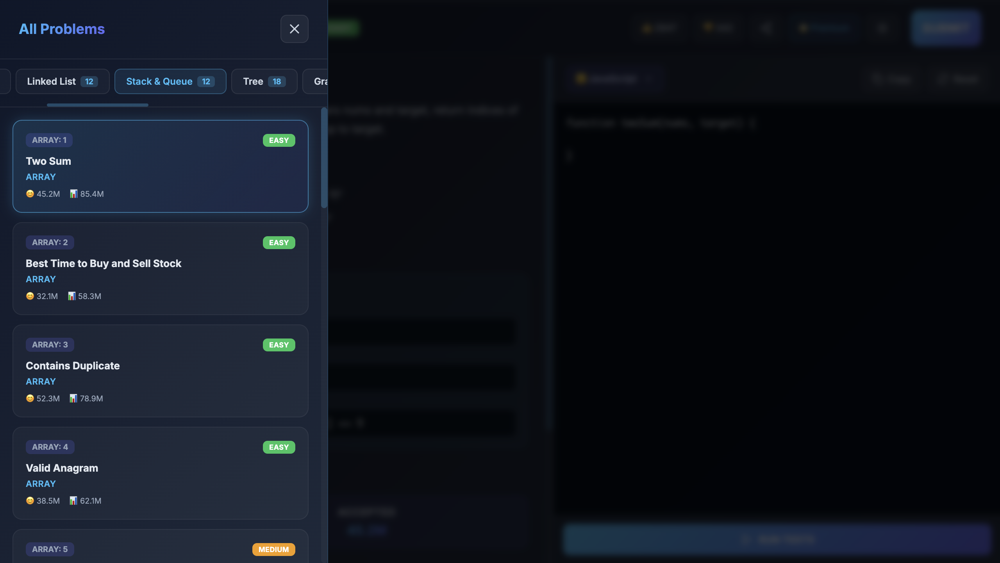
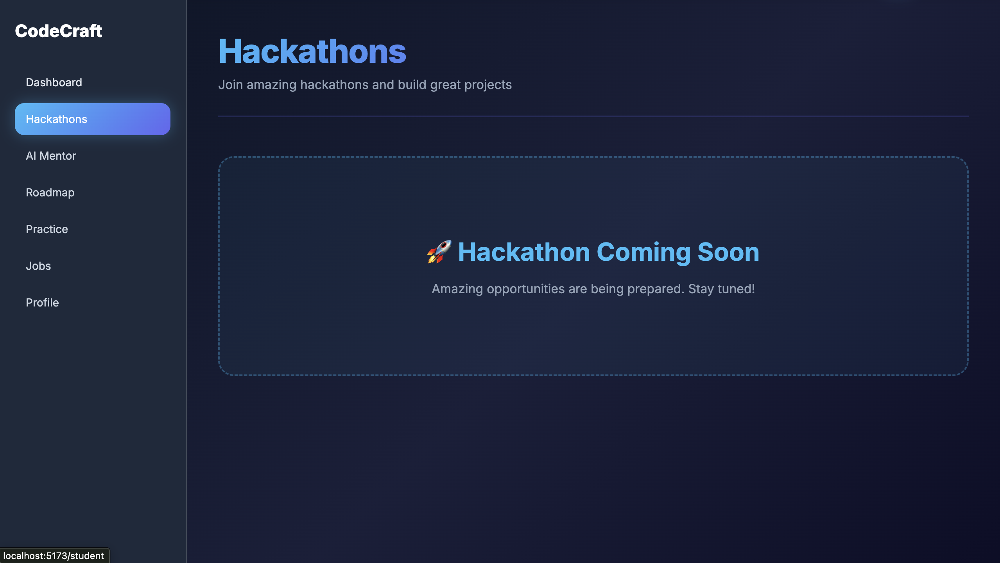
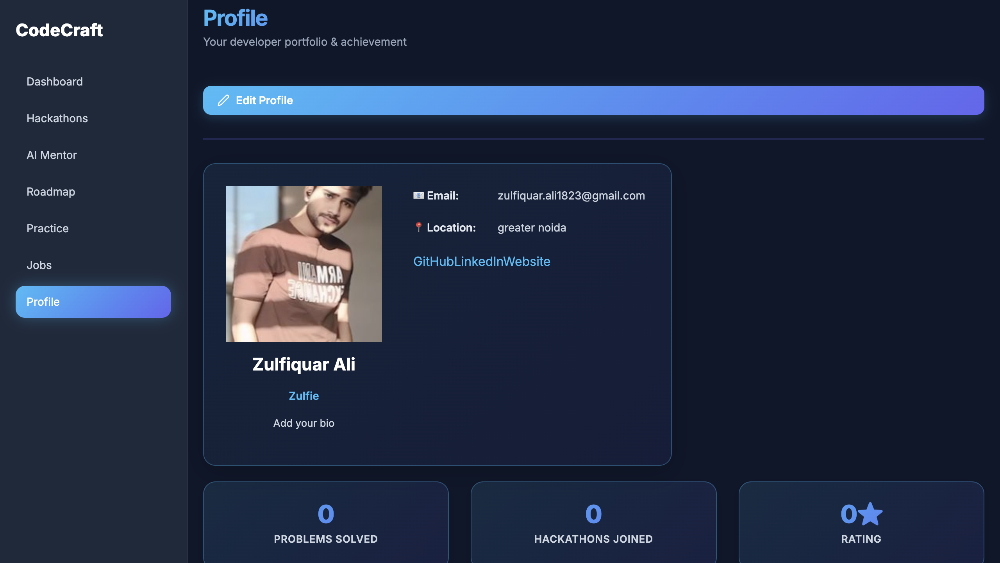
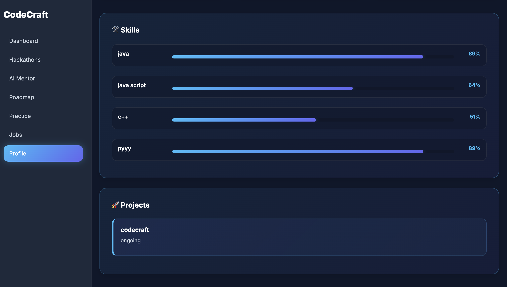
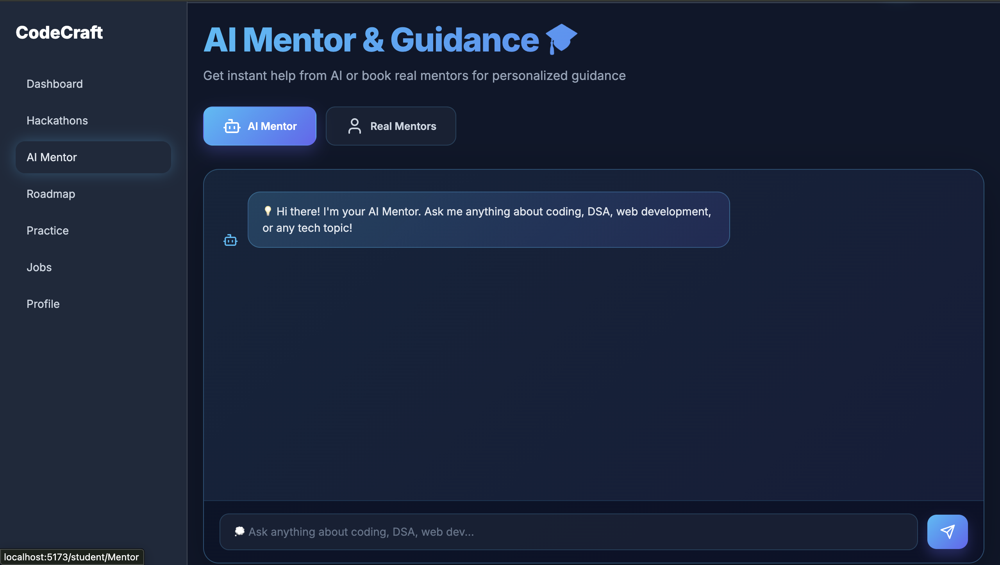
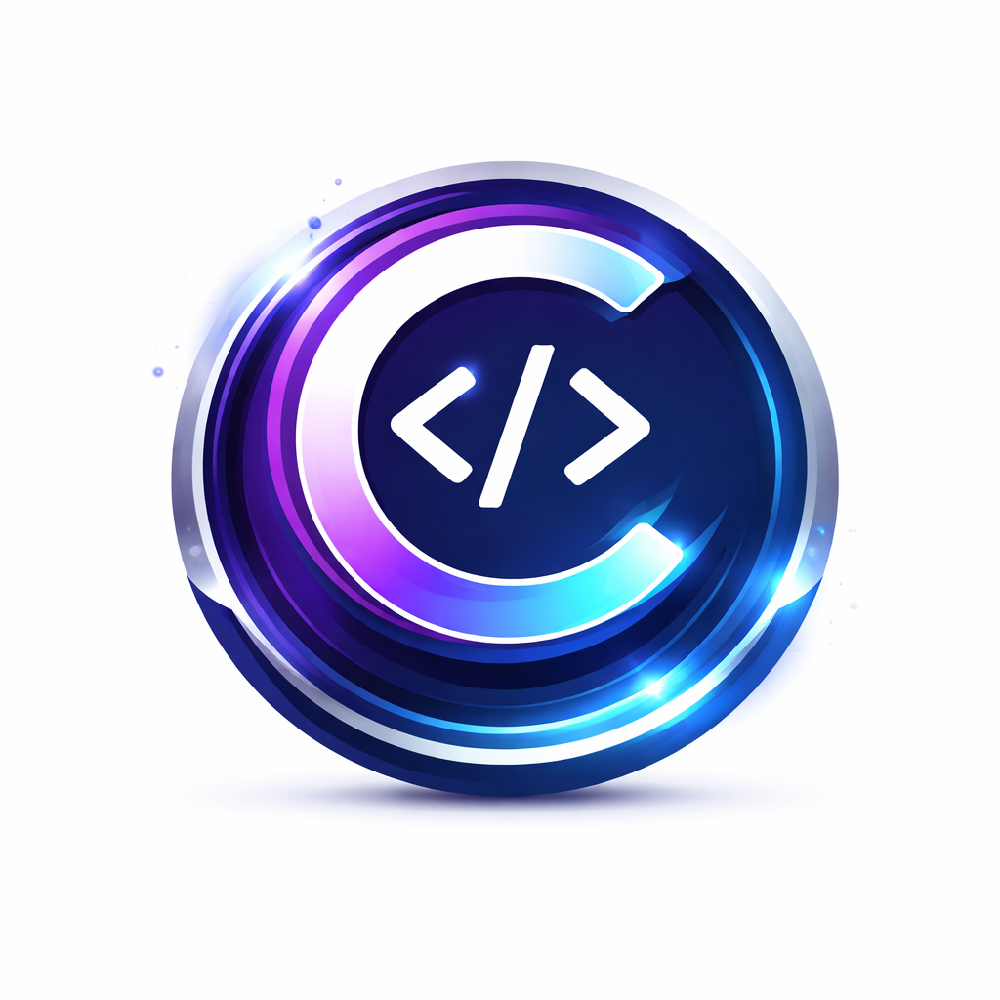

# CodeCraft

A comprehensive full-stack platform for coding education, hackathon management, and job opportunities. CodeCraft connects students with learning resources, hackathon participation, and career opportunities.

## 🌟 Features

### For Students
- **Dashboard**: Track progress, view opportunities, and manage projects
- **Coding Practice**: Interactive coding challenges and problem-solving
- **Hackathon Participation**: Discover and join hackathons
- **Job Portal**: Browse and apply for tech jobs
- **Mentor Support**: Access AI-powered mentor guidance
- **Project Showcase**: Display your projects to recruiters
- **Personalized Roadmap**: Career and learning path recommendations

### For Organizers
- **Hackathon Management**: Create and manage hackathons
- **Participant Tracking**: Monitor participant engagement and submissions
- **Dashboard Analytics**: View hackathon statistics and insights

### For Recruiters
- **Job Posting**: Post job opportunities and manage applications
- **Candidate Search**: Find and review student profiles and projects
- **Application Management**: Track candidate applications

## 📸 Screenshots

### Landing Page & Authentication

*Main landing page showcasing CodeCraft platform*


*Secure login interface*


*User registration for new members*

### Student Dashboard & Features

*Comprehensive student dashboard with quick access to all features*


*Interactive coding practice environment*


*Advanced coding challenges and problem sets*


*Job opportunities and career listings*


*Hackathon discovery and participation*

### Additional Features

*Student project portfolio showcase*


*Extended portfolio for displaying projects to recruiters*


*Personalized learning and career roadmap*


*AI-powered mentor guidance and recommendations*

### Logo

*CodeCraft branding identity*

## 📋 Tech Stack

### Frontend
- **React** 19.2.0 - UI framework
- **Vite** 7.2.4 - Build tool
- **React Router** 7.11.0 - Routing
- **Axios** 1.7.2 - HTTP client
- **Lucide React** 0.408.0 - Icons

### Backend
- **Node.js** & **Express** 4.21.0 - Backend framework
- **MongoDB** & **Mongoose** 8.0.3 - Database
- **JWT** - Authentication
- **bcryptjs** - Password hashing
- **OpenAI** - AI mentor features
- **Nodemailer** - Email notifications
- **CORS** - Cross-origin requests

## 🚀 Getting Started

### Prerequisites
- Node.js (v18+)
- MongoDB (local or cloud)
- npm or yarn
- OpenAI API key (for AI mentor features)

### Installation

#### 1. Clone the repository
```bash
git clone https://github.com/yourusername/CodeCraft.git
cd CodeCraft
```

#### 2. Backend Setup
```bash
cd backend
npm install
```

Create a `.env` file in the backend directory:
```env
DATABASE_URL=mongodb://localhost:27017/codecraft
PORT=5000
JWT_SECRET=your_jwt_secret_key_here
OPENAI_API_KEY=your_openai_api_key
SMTP_USER=your_email@gmail.com
SMTP_PASS=your_app_password
NODE_ENV=development
```

Start the backend server:
```bash
npm run dev    # Development with nodemon
npm start      # Production
```

#### 3. Frontend Setup
```bash
cd frontend
npm install
```

Create a `.env` file in the frontend directory:
```env
VITE_API_URL=http://localhost:5000/api
```

Start the development server:
```bash
npm run dev
```

Build for production:
```bash
npm run build
```

## 📁 Project Structure

```
CodeCraft/
├── backend/
│   ├── src/
│   │   ├── config/           # Database and CORS configuration
│   │   ├── controllers/       # Business logic
│   │   ├── models/            # MongoDB schemas
│   │   ├── routes/            # API endpoints
│   │   ├── middleware/        # Auth, error handling
│   │   ├── utils/             # Helper functions
│   │   ├── app.js             # Express app setup
│   │   └── server.js          # Server entry point
│   └── package.json
│
├── frontend/
│   ├── src/
│   │   ├── api/               # Axios configuration
│   │   ├── components/        # Reusable components
│   │   ├── pages/             # Page components (organizer, recruiter, student)
│   │   ├── layouts/           # Layout wrappers
│   │   ├── context/           # React context (themes)
│   │   ├── styles/            # CSS files
│   │   ├── utils/             # Helper functions
│   │   ├── App.jsx            # Main app component
│   │   └── main.jsx           # React entry point
│   └── package.json
│
├── .gitignore
├── README.md
└── JUDGE0_SETUP.md            # Judge0 API setup documentation
```

## 🔑 Environment Variables

### Backend (.env)
- `DATABASE_URL` - MongoDB connection string
- `PORT` - Server port (default: 5000)
- `JWT_SECRET` - Secret key for JWT tokens
- `OPENAI_API_KEY` - OpenAI API key for AI features
- `SMTP_USER` - Email service username
- `SMTP_PASS` - Email service password
- `NODE_ENV` - Environment (development/production)

### Frontend (.env)
- `VITE_API_URL` - Backend API URL

## 📚 API Documentation

The backend provides RESTful API endpoints for:
- **Authentication** (`/api/auth`) - Login, register, token refresh
- **Users** (`/api/users`) - User profile management
- **Projects** (`/api/projects`) - Student project management
- **Jobs** (`/api/jobs`) - Job posting and applications
- **AI Mentor** (`/api/ai`) - AI-powered guidance
- **Hackathons** - Hackathon management (organizer)

## 🛠️ Available Scripts

### Backend
```bash
npm run dev    # Start development server with auto-reload
npm start      # Start production server
npm test       # Run tests (if configured)
```

### Frontend
```bash
npm run dev     # Start development server
npm run build   # Build for production
npm run preview # Preview production build
npm run lint    # Run ESLint
```

## 🤝 Contributing

Contributions are welcome! Please follow these steps:

1. Fork the repository
2. Create a feature branch (`git checkout -b feature/AmazingFeature`)
3. Commit your changes (`git commit -m 'Add AmazingFeature'`)
4. Push to the branch (`git push origin feature/AmazingFeature`)
5. Open a Pull Request

## 📝 License

This project is licensed under the ISC License - see the LICENSE file for details.

## 🤖 Mentor & Learning Features

CodeCraft integrates OpenAI's API to provide:
- Real-time code review suggestions
- Problem-solving hints
- Learning path recommendations
- Career guidance

## 🔐 Security Features

- JWT-based authentication
- Password hashing with bcryptjs
- Role-based access control (RBAC)
- CORS protection
- Environment variable protection

## 📞 Support

For issues and questions:
- Create an issue on GitHub
- Contact the development team

## 🗺️ Roadmap

- [ ] Real-time collaboration features
- [ ] Advanced analytics dashboard
- [ ] Mobile app
- [ ] Video tutorials integration
- [ ] Automated code testing pipeline

---

**Made with ❤️ by the CodeCraft Team**
